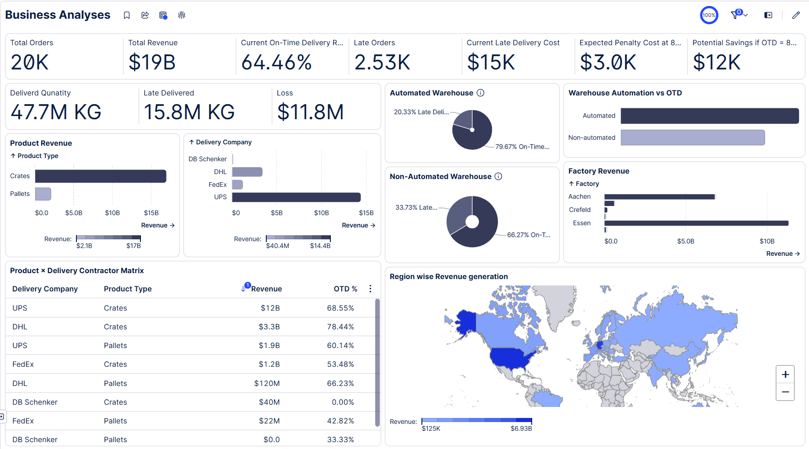

<div align="center">

# 🪵 WoodCorp — On-Time Delivery Process Mining

**Celonis EMS · Order-to-Cash · Process Mining · PQL Analytics**

[](https://www.celonis.com)
[](analysis/business_case_calculations.md)
[](analysis/insights_summary.md)
[](analysis/business_case_calculations.md)
[](LICENSE)

*A full end-to-end process mining study of WoodCorp's Order-to-Cash cycle — uncovering €11.8M in annual penalty costs and a clear roadmap to €5.2M in savings.*

</div>

---

## 📌 Table of Contents

- [Project Overview](#-project-overview)
- [Key Metrics at a Glance](#-key-metrics-at-a-glance)
- [Dashboards](#-dashboards)
- [Repository Structure](#-repository-structure)
- [Analysis Highlights](#-analysis-highlights)
  - [Business Case](#business-case)
  - [Factory Performance](#factory-performance)
  - [Carrier Performance](#carrier-performance)
  - [Improvement Roadmap](#improvement-roadmap)
- [Methodology](#-methodology)
- [Technologies & Tools](#-technologies--tools)
- [Documentation](#-documentation)

---

## 🏭 Project Overview

**WoodCorp** is a German manufacturer of pallets and crates, operating six factories across Germany (Essen, Aachen, Bonn, Crefeld, Duisburg, Wuppertal) and shipping to **309 customers** in the Retail, Transportation, Construction, and Other markets across Europe and the United States.

This repository contains a complete **Celonis process mining analysis** of WoodCorp's **Order-to-Cash (O2C)** process, focused on diagnosing and resolving a systemic **On-Time Delivery (OTD) failure** that affects 35.54% of all orders and generates significant financial penalties.

> **Data Scope:** 19,953 orders · 210,135 activity events · €210M total revenue

---

## 📊 Key Metrics at a Glance

<table>
<tr>
<td align="center" width="200">
<h3>📦 19,953</h3>
Total Orders
</td>
<td align="center" width="200">
<h3>💶 €210M</h3>
Total Revenue
</td>
<td align="center" width="200">
<h3>👥 309</h3>
Unique Customers
</td>
<td align="center" width="200">
<h3>⚙️ 210,135</h3>
Activity Events
</td>
</tr>
</table>

<table>
<tr>
<td align="center" width="200">
<h3>✅ 64.46%</h3>
On-Time Delivery Rate
<br><sub><i>(target: 80%)</i></sub>
</td>
<td align="center" width="200">
<h3>⚠️ 35.54%</h3>
Late Delivery Rate
<br><sub><i>(7,091 orders)</i></sub>
</td>
<td align="center" width="200">
<h3>💸 €11.8M</h3>
Annual Penalty Cost
</td>
<td align="center" width="200">
<h3>🎯 €5.2M</h3>
Savings Potential
<br><sub><i>(at OTD 80%)</i></sub>
</td>
</tr>
</table>

---

## 📸 Dashboards

Four dashboards were built in Celonis EMS to provide full visibility across the O2C process:

### 💼 Business Case
> Penalty costs, savings potential, revenue at risk, and cost-of-delay breakdown.



---

### 🛒 Sales & Orders
> Revenue by customer, country, product type, and delivery company.


---

### 👤 Customer Analyses
> OTD rate, late %, and revenue by customer and market segment.


---

### 🏗️ Factory Analyses
> OTD %, volume conformance, average delivery delay by factory and warehouse type.


---

## 🗂️ Repository Structure

```
Celonis_WoodCorp_Analyses/
│
├── 📁 data/                              # Raw O2C dataset (CSV)
│   ├── Woodcorp O2C Case table.csv       # 19,953 order-level records
│   └── Woodcorp O2C Activity table.csv   # 210,135 event-level records
│
├── 📁 dashboards/                        # Celonis dashboard screenshots
│   ├── Business.png
│   ├── Sales & Orders.png
│   ├── Customer analyses.png
│   └── Factory Analyses.png
│
├── 📁 analysis/                          # Analytical documents
│   ├── business_case_calculations.md     # Full financial business case
│   ├── insights_summary.md               # Key findings summary
│   └── pql_queries.md                    # All PQL query definitions
│
├── 📁 docs/                              # Supporting documentation
│   ├── case_description.md               # Business context and objectives
│   └── methodology.md                    # 6-step analysis methodology
│
├── 📁 presentation/                      # Stakeholder presentation
│   └── Improving-On-Time-Delivery-using-Process-Mining.pptx
│
└── README.md
```

---

## 🔍 Analysis Highlights

### Business Case

| Scenario | Late Qty (kg) | Penalty Cost | OTD % |
|---|---|---|---|
| **Current State** | 15,766,358 | **€11,824,769** | 64.46% |
| **Target (OTD 80%)** | 8,873,517 | €6,655,138 | 80.00% |
| **🎯 Savings** | −6,892,841 | **€5,169,631** | +15.54pp |

> 💡 **€68.6M of annual revenue** (32.7%) is currently at risk due to late deliveries.
> 70.9% of customers (219/309) have experienced at least one late delivery.

---

### Factory Performance

| Factory | Orders | Revenue (€) | OTD % | Avg Delay (days) |
|---|---|---|---|---|
| Essen | 9,093 | 111,795,290 | 65.6% | −0.3 |
| **Aachen** ⚠️ | 8,138 | 85,432,721 | **61.4%** | **+0.8** |
| Bonn | 1,166 | 8,408,160 | 69.0% | +0.4 |
| Crefeld | 1,415 | 3,440,940 | 70.1% | +0.4 |
| Duisburg | 133 | 828,370 | 69.2% | +0.9 |
| Wuppertal | 8 | 194,204 | 87.5% | −3.9 |

> ⚠️ **Essen + Aachen** account for **87% of orders** and **93% of revenue** — yet are the worst OTD performers.

---

### Carrier Performance

| Carrier | Orders | OTD % | Status |
|---|---|---|---|
| UPS | 17,956 (90%) | 64.4% | 🟡 Primary volume, needs improvement |
| **DHL** | 1,259 | **75.5%** | 🟢 Best performer |
| **FedEx** | 722 | **48.3%** | 🔴 High-risk, below target |
| **DB Schenker** | 16 | **6.2%** | 🔴 Critical, review/replace |

---

### Improvement Roadmap

| Priority | Action | Expected Impact |
|---|---|---|
| 🥇 1 | Fix production scheduling at **Essen & Aachen** (23,693 rescheduling events) | Largest OTD gain |
| 🥈 2 | Replace / renegotiate **FedEx** (48.3%) and **DB Schenker** (6.2%) — redirect to DHL | Eliminate carrier OTD drag |
| 🥉 3 | Launch OTD improvement programme at **Aachen factory** (61.4% OTD) | Direct penalty reduction |
| 4 | Pilot **warehouse automation** at high-volume non-automated sites (79.6% vs 64.4% OTD) | Long-term structural gain |
| 5 | Stabilise **order quantities** (97.9% change-quantity rate → 49.35% volume conformance) | Reduce rework & variance |
| 6 | Assign key account managers to **Götz** (48.1% late), **Becker** (46.8%), **Meißner** (55.4%) | Protect €30M+ revenue |

---

## 🔬 Methodology

The analysis follows a 6-step process mining methodology:

```
1. Data Integration   →  Upload Case & Activity tables into Celonis EMS; join on CASE_KEY
2. Data Modelling     →  Define Case ID, Activity, Timestamp; add IS_LATE, DELAY_DAYS, LATE_QTY
3. KPI Dashboards     →  Build 4 views: Business Case, Sales & Orders, Customer, Factory
4. Root Cause ID      →  Identify high-frequency rework activities in the process flow
5. Business Case      →  Quantify penalty savings using €0.75/kg late-delivery penalty rate
6. Recommendations    →  Prioritise 6 improvement levers for OTD 64.5% → 80%+
```

**Key root-cause activities identified:**

| Activity | Occurrences | Signal |
|---|---|---|
| Change production start date | 23,693 | Production scheduling instability |
| Change quantity | 19,525 (97.9% of orders) | Demand uncertainty, low volume conformance |
| Change delivery date | 13,661 (68.5% of orders) | Reactive date management |
| Credit order block | 2,006 (10.1% of orders) | Order flow interruption |

---

## 🛠️ Technologies & Tools

| Tool | Purpose |
|---|---|
| [Celonis EMS](https://www.celonis.com) | Process mining platform, dashboards, PQL execution |
| **PQL (Process Query Language)** | SQL-like analytics language for O2C KPI calculations |
| **CSV / Tabular Data** | Raw order and activity data files |
| **PowerPoint** | Stakeholder presentation |

---

## 📚 Documentation

| Document | Description |
|---|---|
| [`docs/case_description.md`](docs/case_description.md) | Business context, dataset schema, and objectives |
| [`docs/methodology.md`](docs/methodology.md) | 6-step analysis methodology with formulas |
| [`analysis/business_case_calculations.md`](analysis/business_case_calculations.md) | Full in-depth financial business case (14 sections) |
| [`analysis/insights_summary.md`](analysis/insights_summary.md) | Concise key findings across all dimensions |
| [`analysis/pql_queries.md`](analysis/pql_queries.md) | All Celonis PQL dashboard query definitions |
| [`presentation/Improving-On-Time-Delivery-using-Process-Mining.pptx`](presentation/Improving-On-Time-Delivery-using-Process-Mining.pptx) | Stakeholder deck: *Improving On-Time Delivery using Process Mining* |

---

<div align="center">

**Made with 📊 Process Mining · Powered by Celonis EMS**

*If you find this analysis useful, consider leaving a ⭐ on the repository.*

</div>
